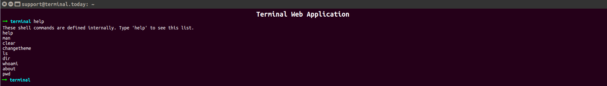

Terminal
========



Web application that fascinated with terminal behavior.
 
Proof of concept can be viewed in [https://datamate.github.io/](https://datamate.github.io/)

#### Install pacakges
Install packages using ```yarn```

```bash
yarn install
```

#### Run project
- Run using yarn
    ```bash
    yarn start
    ```

- Run using NPM
    ```bash
    npm start
    ```
#### Create optimized production build
- Build using yarn
    ```bash
    yarn build
    ```

- Build using NPM
    ```bash
    npm run build
    ```

#### Deployment
- Update the production site git information in `deploy.sh`
  ```
  git remote add origin YOUR_GIT_ORIGIN_URL
  ```
- Change permission of the file `deploy.sh`:
  ```
  chmod 777 deploy.sh
  ```
- Deploy the site:
  ```
  ./deploy.sh
  ```

#### Development Status

3 - Alpha

#### Development Status Phases
1. Planning
2. Pre-Alpha
3. Alpha
4. Beta
5. Production/Stable
6. Mature
7. Inactive

<hr>

**Author**: [Ahmedur Rahman Shovon](https://arshovon.com)
